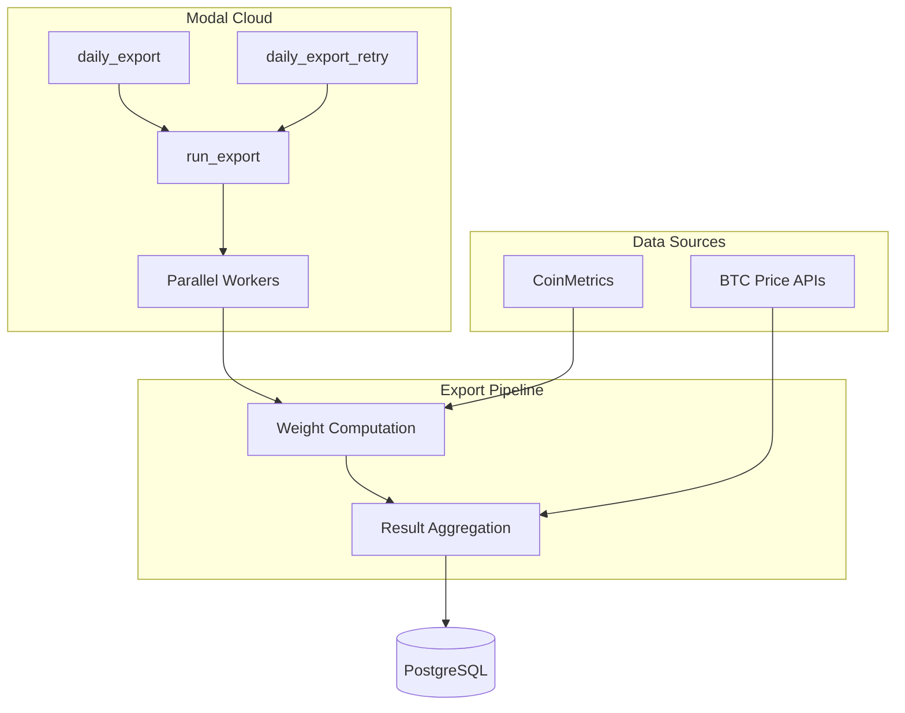

# Modal App Documentation

Cloud-based automation for computing and storing dynamic Bitcoin DCA investment weights.

## Table of Contents

- [Overview](#overview)
- [Output](#output)
- [Architecture](#architecture)
- [Scheduled Jobs](#scheduled-jobs)
- [Functions](#functions)
- [Data Pipeline](#data-pipeline)
- [Database](#database)
- [Configuration](#configuration)
- [Deployment](#deployment)
- [Testing](#testing)
- [Troubleshooting](#troubleshooting)

## Overview

The Modal app (`modal_app.py`) automates daily weight computation and database updates:

- Computes weights for ~730 date range permutations using an ML model
- Runs daily with automatic retry logic
- Stores results in PostgreSQL for real-time querying
- Fetches BTC prices from multiple APIs (CoinGecko, Coinbase, Bitstamp)
- Processes in parallel using Modal's distributed computing

The app detects database state automatically: empty tables trigger a full insert, existing data triggers incremental updates for today only.

## Output

The Modal app produces a dataset of **dynamic DCA weights** stored in the `bitcoin_dca` table. Each row represents one day within a 1-year investment window.

### Output Structure

| Column | Type | Description |
| ------ | ---- | ----------- |
| `id` | INTEGER | Day index within the range (0 = first day) |
| `start_date` | DATE | Investment window start |
| `end_date` | DATE | Investment window end (1 year after start) |
| `DCA_date` | DATE | Specific purchase date |
| `btc_usd` | FLOAT | BTC price on that date (NULL for future dates) |
| `weight` | FLOAT | Investment allocation (0 to 1, sums to 1.0 per range) |
| `last_updated` | TIMESTAMP | When the row was last modified |

### Example Output

For a range starting 2025-12-07 and ending 2026-12-07:

```text
id | start_date | end_date   | DCA_date   | btc_usd  | weight
---|------------|------------|------------|----------|--------
0  | 2025-12-07 | 2026-12-07 | 2025-12-07 | 97500.00 | 0.00312
1  | 2025-12-07 | 2026-12-07 | 2025-12-08 | 98100.00 | 0.00287
2  | 2025-12-07 | 2026-12-07 | 2025-12-09 | NULL     | 0.00274
...
365| 2025-12-07 | 2026-12-07 | 2026-12-07 | NULL     | 0.00198
```

### Key Characteristics

- **~730 date ranges**: One range per possible start date (daily from `RANGE_START` to `RANGE_END - 1 year`)
- **~366 rows per range**: One row per day in the 1-year window
- **~267K total rows**: All ranges × days per range
- **Weights sum to 1.0**: Within each (start_date, end_date) pair
- **Minimum weight**: `1e-6` floor prevents zero allocations
- **Past vs Future**: Past dates have actual BTC prices; future dates have NULL prices but computed weights
- **Weight Strategy**: 
  - **Past dates** (before today): ML model weights (locked, never change)
  - **Current date**: Model weight for today (updated daily)
  - **Future dates** (after today): Uniform weights for remaining budget (recalculated daily)

### Interpreting Weights

The `weight` column tells you what fraction of your total investment to allocate on each `DCA_date`:

- **Higher weight** → Model suggests investing more on this date (favorable conditions)
- **Lower weight** → Model suggests investing less (unfavorable conditions)
- **Uniform DCA** would assign `1/366 ≈ 0.00273` to each day

Weights are dynamic based on z-score features computed from historical price patterns. The model uses a beta mixture approach that adapts allocation based on market conditions at the start of each window.

### Querying the Output

```sql
-- Get weights for a specific investment window
SELECT DCA_date, btc_usd, weight 
FROM bitcoin_dca 
WHERE start_date = '2025-12-07' AND end_date = '2026-12-07'
ORDER BY DCA_date;

-- Find highest-weight days in a range
SELECT DCA_date, weight 
FROM bitcoin_dca 
WHERE start_date = '2025-12-07' AND end_date = '2026-12-07'
ORDER BY weight DESC LIMIT 10;

-- Verify weights sum to 1
SELECT start_date, end_date, SUM(weight) as total_weight
FROM bitcoin_dca
GROUP BY start_date, end_date;
```

## Architecture



**Data Flow:**

1. Cron triggers `daily_export` (4 AM HST)
2. `run_export` loads data, generates date ranges, precomputes features
3. Work distributed to parallel workers (50 start dates per batch)
4. Results aggregated and written to database
5. If table has data, only today's rows are updated with fresh BTC price

## Scheduled Jobs

| Job | Schedule (UTC) | Purpose | Retries |
| --- | -------------- | ------- | ------- |
| `daily_export` | `0 14 * * *` (Daily 4 AM HST) | Primary daily update | 3 |
| `daily_export_retry` | `0 20 * * *` (Daily 10 AM HST) | Backup if primary fails | 2 |

Both jobs have a 30-minute timeout and use Modal secrets for database and API credentials.

**Primary Job Workflow:**

1. Compute all weights via `run_export.remote()`:
   - Past weights: Use ML model (locked, unchanged)
   - Today's weight: Compute model weight for current date
   - Future weights: Uniform distribution of remaining budget
2. Connect to database
3. If table empty → bulk INSERT all data
4. If table has data → UPDATE only today's rows (weight + BTC price)

**Retry Job Workflow:**

1. Skip if table is empty (initial run needed)
2. Skip if today's data already exists
3. Otherwise, run export and update today's data

## Functions

### `process_start_date_batch_modal`

Parallel worker that processes all date ranges sharing one start date.

**Input:** Tuple of (start_date, end_dates[], current_date, btc_price_col, pickled DataFrames)

**Output:** DataFrame with columns: `id`, `start_date`, `end_date`, `DCA_date`, `btc_usd`, `weight`

### `run_export`

Coordinator function that orchestrates the full pipeline:

1. Load BTC data from CoinMetrics
2. Generate date ranges (1-year spans, daily frequency)
3. Precompute z-score features
4. Distribute to workers via `.map()` (50 start dates per batch)
5. Aggregate results

**Returns:** `(final_df, metadata_dict)`

### `daily_export` / `daily_export_retry`

Scheduled cron jobs that call `run_export` and handle database operations.

### Disabled Endpoints

`get_latest_export` and `export_weights_api` are defined but disabled. Uncomment decorators to enable API access.

## Data Pipeline

### Date Range Generation

Generates ~730 date ranges with 1-year spans:

- Start dates: Daily from `RANGE_START` to `RANGE_END - 1 year`
- End dates: Exactly 1 year after each start date
- Grouped by start date to optimize weight computation

### Feature Precomputation

Z-scores computed for log prices across windows: 30, 90, 180, 365, 1461 days.

Features are lagged 1 day (no forward leakage) and clipped to [-4, 4].

### Weight Computation

**Weight Strategy**:
- **Past dates** (before `current_date`): ML model weights computed using beta mixture model (LOCKED, never change)
- **Current date**: Model weight for today (updated daily)
- **Future dates** (after `current_date`): Uniform weights for remaining budget `(1.0 - sum of past weights) / n_future`

**Model Computation** (for past/current dates):
1. Softmax of alpha × features → mixture weights
2. Beta mixture PDF → base weights
3. exp(-features × beta) → dynamic component
4. Base × Dynamic, normalized with min weight floor (`1e-6`)

**Key Invariant**: Past weights NEVER change once computed. As time advances, more weights get "locked in" and the remaining budget for future dates decreases.

## Database

### Schema

```sql
CREATE TABLE bitcoin_dca (
    id INTEGER,
    start_date DATE,
    end_date DATE,
    DCA_date DATE,
    btc_usd FLOAT,
    weight FLOAT,
    last_updated TIMESTAMP DEFAULT CURRENT_TIMESTAMP,
    PRIMARY KEY (id, start_date, end_date, DCA_date)
)
```

A trigger auto-updates `last_updated` on any UPDATE.

### Operations

| Operation | Method | Performance |
| --------- | ------ | ----------- |
| Initial load | `COPY FROM` (fallback: `execute_values`) | ~100K rows/sec |
| Daily update (today's rows) | Bulk UPDATE with VALUES clause | ~10K-50K rows/sec |

### BTC Price Fetching

Multi-source with retry logic:

1. CoinGecko (primary)
2. Coinbase (fallback)
3. Bitstamp (fallback)

Each source: 3 attempts with exponential backoff (2-10s). Validates price range ($1K-$1M).

## Configuration

### Constants

| File | Constant | Value |
| ---- | -------- | ----- |
| `export_weights.py` | `RANGE_START` | "2025-12-01" |
| `export_weights.py` | `RANGE_END` | "2027-12-31" |
| `export_weights.py` | `MIN_RANGE_LENGTH_DAYS` | 120 |
| `model_development.py` | `MIN_W` | 1e-6 |
| `model_development.py` | `WINS` | [30, 90, 180, 365, 1461] |
| `modal_app.py` | Timeout | 1800s |
| `modal_app.py` | Batch size | 50 start dates |

### Environment Variables (Modal Secrets)

- `DATABASE_URL` → secret `database_url`
- `BITCOIN_WEIGHTS_API_KEY` → secret `bitcoin-weights-secret`

## Deployment

### Deploy

```bash
modal deploy modal_app.py
```

### Manual Execution

```bash
modal run modal_app.py::main        # Test export
modal run modal_app.py::run_export  # Trigger export
modal app list                      # View status
```

### Secret Setup

```bash
modal secret create database_url DATABASE_URL=<connection-string>
modal secret create bitcoin-weights-secret BITCOIN_WEIGHTS_API_KEY=<key>
```

### Local Development

```bash
python export_weights.py  # Run without Modal
```

## Testing

The Modal infrastructure and data pipeline are covered by dedicated test modules:

- **Modal App Logic** (`tests/test_modal_app.py`): Verifies the orchestration of `daily_export` and `daily_export_retry` using mocks for cloud-decorated functions.
- **Database Operations** (`tests/test_export_weights_database.py`): Validates schema creation, bulk data insertion (including `COPY FROM` performance path), and incremental daily updates.
- **Data Acquisition** (`tests/test_coinmetrics_btc_csv.py`): Ensures robust fetching and cleaning of remote CSV data from CoinMetrics.
- **Plotting Validation** (`tests/test_plotting.py`): Confirms that MVRV and DCA weight plots are generated correctly as SVG files.

Run these tests via:
```bash
pytest tests/test_modal_app.py tests/test_export_weights_database.py tests/test_coinmetrics_btc_csv.py tests/test_plotting.py -v
```

## Troubleshooting

### Health Checks

```sql
-- Latest update
SELECT MAX(last_updated) FROM bitcoin_dca;

-- Today's data count
SELECT COUNT(*) FROM bitcoin_dca 
WHERE DCA_date = CURRENT_DATE AND btc_usd IS NOT NULL;

-- Recent data
SELECT DCA_date, COUNT(*) FROM bitcoin_dca 
GROUP BY DCA_date ORDER BY DCA_date DESC LIMIT 10;
```

### Common Issues

| Issue | Symptoms | Solutions |
| ----- | -------- | --------- |
| API errors | "Failed to fetch BTC price" | Check rate limits; wait for retry job; manual trigger |
| DB connection | "DATABASE_URL not set" | Verify Modal secret; check DB allows Modal IPs |
| Timeout | Function exceeds 30 min | Reduce batch size; increase timeout |
| Bad weights | NaN/Inf values | Check feature precomputation; verify price data |
| Retry skips | "data_already_exists" | Normal if primary succeeded; check `today_data_exists()` |

### Logs

- **Modal:** Dashboard → function name → logs
- **Local:** Python `logging` module at INFO level

## Related Files

- [`modal_app.py`](modal_app.py) - Modal app definition
- [`export_weights.py`](export_weights.py) - Core export logic
- [`model_development.py`](model_development.py) - ML model
- [`btc_price_fetcher.py`](btc_price_fetcher.py) - Price API integration
- [`prelude.py`](prelude.py) - Data loading
