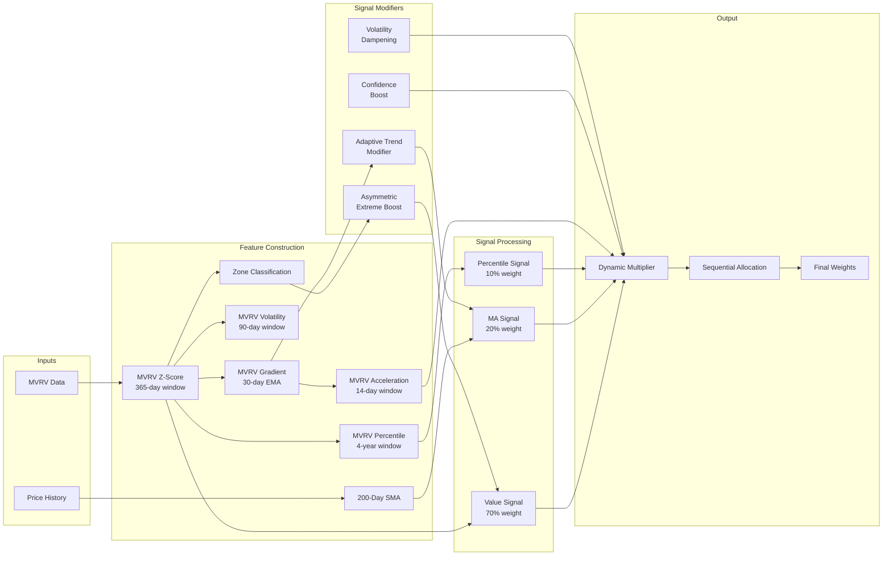

# Bitcoin DCA Weight Computation Model

This document explains the ML model that computes dynamic DCA (Dollar Cost Averaging) weights for Bitcoin investment strategies based on MVRV (Market Value to Realized Value) and price relative to the 200-day moving average.

## Table of Contents

- [Overview](#overview)
- [Model Architecture](#model-architecture)
- [Signal Composition](#signal-composition)
- [Feature Construction](#feature-construction)
- [Dynamic Multiplier Computation](#dynamic-multiplier-computation)
- [Sequential Allocation](#sequential-allocation)
- [Weight Computation Functions](#weight-computation-functions)
- [Constants Reference](#constants-reference)
- [Feature List](#feature-list)
- [Unit Testing](#unit-testing)
- [Data Requirements](#data-requirements)

## Overview

The model computes daily investment weights that determine how much of your DCA budget to allocate on each day within a given investment window. Unlike uniform DCA (equal daily amounts), this model dynamically adjusts weights based on:

1. **MVRV Z-score**: Buy more when undervalued (low MVRV), less when overvalued
2. **Price vs 200-day MA**: Buy more when price is below long-term trend
3. **4-year Halving Cycle Percentile**: Context from Bitcoin's halving cycle
4. **MVRV Momentum**: Acceleration/deceleration of MVRV trends
5. **Signal Confidence**: Amplify signals when multiple indicators agree
6. **Volatility Dampening**: Reduce exposure during high uncertainty periods

**Key Properties:**
- Weights sum to exactly 1.0 for each date range (within tolerance)
- Past weights are **locked** once computed and never change
- Future weights are distributed from the remaining budget
- Weights are deterministic given the same inputs

## Model Architecture



For a window of `n` days, the weight for day `i` is computed as:

```
weight[i] = allocate_sequential_stable(base[i] × dynamic[i])
```

Where:
- `base[i]` = 1/n (uniform base distribution)
- `dynamic[i]` = exp(combined_signal × DYNAMIC_STRENGTH)

## Signal Composition

The model combines three primary signals with two modulation factors:

### Primary Signals (Weighted Combination)

| Signal | Weight | Description |
|--------|--------|-------------|
| MVRV Value Signal | 70% | Low MVRV Z-score → buy more, with asymmetric extreme boost |
| MA Signal | 20% | Below 200-day MA → buy more, with adaptive trend modulation |
| Percentile Signal | 10% | 4-year percentile context from halving cycle |

### Signal Modifiers

| Modifier | Effect | Trigger |
|----------|--------|---------|
| Acceleration | ×[0.85, 1.15] | Momentum building/reversing |
| Confidence Boost | ×[1.0, 1.15] | Only when confidence > 0.7 |
| Volatility Dampening | ×[0.8, 1.0] | Only when volatility > 80th percentile |

## Feature Construction

### 200-Day Simple Moving Average

```python
price_ma200 = price.rolling(200, min_periods=100).mean()
price_vs_ma = (price / price_ma200) - 1  # Clipped to [-1, 1]
```

| Value | Interpretation |
|-------|----------------|
| `price_vs_ma > 0` | Price above 200-day MA (bullish) |
| `price_vs_ma < 0` | Price below 200-day MA (bearish) |
| `price_vs_ma = 0` | Price at 200-day MA |

### MVRV Z-Score

The MVRV Z-score normalizes the MVRV ratio using a 365-day rolling window:

```python
mvrv_zscore = (mvrv - rolling_mean(365)) / rolling_std(365)
# Clipped to [-4, 4]
```

| Z-Score | Zone | Interpretation |
|---------|------|----------------|
| Z < -2.0 | Deep Value | Historically rare buying opportunity |
| -2.0 ≤ Z < -1.0 | Value | Undervalued, increase buying |
| -1.0 ≤ Z < 1.5 | Neutral | Fair value, normal DCA |
| 1.5 ≤ Z < 2.5 | Caution | Overvalued, reduce buying |
| Z ≥ 2.5 | Danger | Extreme overvaluation, minimize buying |

### MVRV Gradient

The gradient detects MVRV trend direction over a 30-day window with EMA smoothing:

```python
gradient_raw = mvrv_zscore.diff(30)
mvrv_gradient = tanh(gradient_raw.ewm(span=30).mean() * 2)
# Result in [-1, 1]
```

| Value | Interpretation |
|-------|----------------|
| `> 0` | MVRV rising (moving toward overvaluation) |
| `< 0` | MVRV falling (moving toward undervaluation) |
| `≈ 0` | Neutral/stable |

### 4-Year Rolling Percentile

Captures Bitcoin's halving cycle context:

```python
mvrv_percentile = rolling_percentile(mvrv, window=1461)  # ~4 years
# Result in [0, 1]
```

| Percentile | Interpretation |
|------------|----------------|
| < 0.25 | Bottom 25% of 4-year range (strong buy) |
| 0.25-0.75 | Middle range (neutral) |
| > 0.75 | Top 25% of 4-year range (reduce buying) |

### MVRV Acceleration

Second derivative for momentum detection:

```python
accel_raw = mvrv_gradient.diff(14)
mvrv_acceleration = tanh(accel_raw.ewm(span=14).mean() * 3)
# Result in [-1, 1]
```

### MVRV Volatility

Rolling volatility for uncertainty detection:

```python
mvrv_volatility = percentile_rank(mvrv_zscore.rolling(90).std())
# Result in [0, 1] where 1 = high volatility
```

### Signal Confidence

Measures agreement between signals:

```python
# When Z-score, percentile, and MA signals agree → confidence ≈ 1
# When signals disagree → confidence ≈ 0
signal_confidence = agreement * 0.7 + gradient_alignment * 0.3
```

### Look-Ahead Bias Prevention

All features are **lagged by 1 day** to prevent information leakage:

```python
features = features.shift(1).fillna(defaults)
```

This ensures the weight for day `t` only uses information available up to day `t-1`.

## Dynamic Multiplier Computation

### Asymmetric Extreme Boost

Bitcoin's MVRV is asymmetric - extreme lows are rare opportunities, while extreme highs often precede corrections:

```python
def compute_asymmetric_extreme_boost(mvrv_zscore):
    # Deep value (Z < -2): Strong positive boost
    # Quadratic: 0.8 * (Z + 2)² + 0.5
    
    # Value zone (-2 ≤ Z < -1): Linear positive boost
    # -0.5 * Z
    
    # Neutral (-1 ≤ Z < 1.5): No boost
    # 0
    
    # Caution (1.5 ≤ Z < 2.5): Moderate negative boost
    # -0.3 * (Z - 1.5)
    
    # Danger (Z ≥ 2.5): Strong negative boost
    # Quadratic: -0.5 * (Z - 2.5)² - 0.3
```

### Adaptive Trend Modifier

Thresholds adapt based on current MVRV level:

```python
def compute_adaptive_trend_modifier(mvrv_gradient, mvrv_zscore):
    # In value zone (Z < -1): Low threshold (0.1) - more sensitive
    # In danger zone (Z > 1.5): High threshold (0.4) - require confirmation
    # Neutral: Standard threshold (0.2)
    
    # Bull (gradient > threshold): up to 1.5x multiplier
    # Bear (gradient < -threshold): down to 0.3x multiplier
```

### Final Multiplier

```python
def compute_dynamic_multiplier(...):
    # 1. Value signal with asymmetric boost
    value_signal = -mvrv_zscore + extreme_boost
    
    # 2. MA signal with adaptive trend modulation
    ma_signal = -price_vs_ma * trend_modifier
    
    # 3. Percentile signal (non-linear emphasis on extremes)
    pct_signal = sign(0.5 - percentile) * |2 * (0.5 - percentile)|^1.5
    
    # 4. Combine with weights
    combined = value_signal * 0.70 + ma_signal * 0.20 + pct_signal * 0.10
    
    # 5. Apply modifiers
    combined *= acceleration_modifier  # [0.85, 1.15]
    combined *= confidence_boost       # [1.0, 1.15] only if confidence > 0.7
    combined *= volatility_dampening   # [0.8, 1.0] only if volatility > 0.8
    
    # 6. Scale and exponentiate
    adjustment = clip(combined * DYNAMIC_STRENGTH, -5, 100)
    return exp(adjustment)
```

## Sequential Allocation

The `allocate_sequential_stable` function ensures all constraints are met:

```python
def allocate_sequential_stable(raw, n_past, locked_weights=None):
    n_total = len(raw)
    base_weight = 1.0 / n_total
    
    # Past days: use signal-based weights
    for i in range(n_past):
        signal = compute_stable_signal_weights(raw[:i+1])[-1]
        w[i] = signal * base_weight
    
    # Future days: uniform distribution
    w[n_past:] = base_weight
    
    # Last day absorbs remainder to ensure sum = 1.0
    w[-1] = 1.0 - sum(w[:-1])
    
    return w
```

## Weight Computation Functions

### compute_weights_fast

Core weight computation for a date range using all enhanced features:

```python
def compute_weights_fast(features_df, start_date, end_date) -> pd.Series:
    # Extract all features: price_vs_ma, mvrv_zscore, mvrv_gradient,
    #   mvrv_percentile, mvrv_acceleration, mvrv_volatility, signal_confidence
    # Compute uniform base PDF
    # Apply dynamic multiplier with all signal layers
    # Return allocated weights
```

### compute_window_weights

Wrapper that handles the past/future weight split for production use:

```python
def compute_window_weights(features_df, start_date, end_date, current_date) -> pd.Series:
    # 1. Extend features with placeholders for future dates
    # 2. Compute FULL range weights
    # 3. Split at current_date boundary:
    #    - Past/current dates: signal-based weights (LOCKED)
    #    - Future dates: uniform weights for remaining budget
    # 4. Return combined weights summing to 1.0
```

**Key Invariant**: As `current_date` advances, more weights get locked in and the remaining budget for future dates decreases.

## Constants Reference

| Constant | Value | Description |
|----------|-------|-------------|
| MIN_W | 1e-6 | Minimum weight floor |
| PRICE_COL | "PriceUSD_coinmetrics" | Price column name |
| MVRV_COL | "CapMVRVCur" | MVRV column from CoinMetrics |
| MA_WINDOW | 200 | 200-day moving average window |
| MVRV_GRADIENT_WINDOW | 30 | Window for MVRV gradient (EMA smoothed) |
| MVRV_ROLLING_WINDOW | 365 | Window for MVRV Z-score normalization |
| MVRV_CYCLE_WINDOW | 1461 | 4-year window for percentile (halving cycle) |
| MVRV_ACCEL_WINDOW | 14 | Window for acceleration calculation |
| MVRV_VOLATILITY_WINDOW | 90 | Window for volatility calculation |
| DYNAMIC_STRENGTH | 5.0 | Weight adjustment multiplier |
| MVRV_VOLATILITY_DAMPENING | 0.2 | Max dampening in extreme volatility |

### MVRV Zone Thresholds

| Zone | Z-Score Threshold | Action |
|------|-------------------|--------|
| Deep Value | Z < -2.0 | Aggressive accumulation |
| Value | -2.0 ≤ Z < -1.0 | Increased buying |
| Neutral | -1.0 ≤ Z < 1.5 | Normal DCA |
| Caution | 1.5 ≤ Z < 2.5 | Reduced buying |
| Danger | Z ≥ 2.5 | Minimized buying |

## Feature List

All features computed by `precompute_features()`:

| Feature | Range | Description |
|---------|-------|-------------|
| `price_vs_ma` | [-1, 1] | Normalized distance from 200-day MA |
| `mvrv_zscore` | [-4, 4] | MVRV Z-score (365-day window) |
| `mvrv_gradient` | [-1, 1] | Smoothed MVRV trend direction |
| `mvrv_percentile` | [0, 1] | 4-year rolling percentile |
| `mvrv_acceleration` | [-1, 1] | Second derivative of gradient |
| `mvrv_zone` | {-2,-1,0,1,2} | Discrete zone classification |
| `mvrv_volatility` | [0, 1] | Rolling volatility percentile |
| `signal_confidence` | [0, 1] | Signal agreement score |

## Unit Testing

Core mathematical and logical components are verified by unit tests in `tests/test_model_development_helpers.py`:

- **Softmax Stability**: Ensuring probabilities sum to 1.0 and remain stable with very large input values.
- **Z-Score Normalization**: Verifying rolling window mean/std centering.
- **Rolling Percentile**: Correctness of the 4-year halving cycle context computation.
- **MVRV Zone Classification**: Validating the discrete mapping of Z-scores to investment regimes (Value, Neutral, Caution, etc.).
- **Signal Confidence**: Testing the weighted agreement logic between MVRV and MA signals.

Run model-specific tests via:
```bash
pytest tests/test_model_development_helpers.py tests/test_model_development.py -v
```

## Data Requirements

The model requires the following columns from the CoinMetrics BTC data:

| Column | Description | Required |
|--------|-------------|----------|
| `PriceUSD_coinmetrics` | Daily BTC price in USD | Yes |
| `CapMVRVCur` | Market Value to Realized Value ratio | Optional* |

*If MVRV data is not available, the model falls back to neutral signals (no dynamic adjustment).