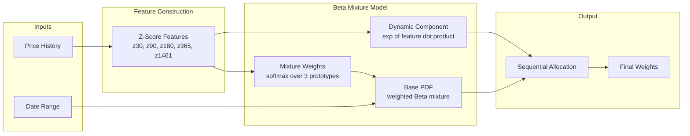

# Bitcoin DCA Weight Computation Model

This document explains the ML model that computes dynamic DCA (Dollar Cost Averaging) weights for Bitcoin investment strategies based on historical price patterns.

## Overview

The model computes daily investment weights that determine how much of your DCA budget to allocate on each day within a given investment window. Unlike uniform DCA (equal daily amounts), this model dynamically adjusts weights based on historical price z-scores to potentially improve returns.

**Key Properties:**
- Weights sum to exactly 1.0 for each date range (within tolerance of 1e-6)
- All weights are ≥ MIN_W (1e-6) to prevent zero allocations
- Past weights are **locked** once computed and never change
- Future weights are **uniform** (remaining budget distributed evenly)
- Weights are deterministic given the same inputs

## Model Architecture

The weight computation uses a **Beta Mixture Model** with **dynamic adjustments** based on z-score features.



For a window of `n` days, the weight for day `i` is computed as:

```
weight[i] = allocate_sequential_stable(base[i] × dynamic[i])
```

Where:
- `base[i]` = Beta mixture PDF at normalized position `i/n`
- `dynamic[i]` = exp(-features[i] · β)

## Feature Construction

### Z-Score Features

The model uses z-scores of log prices computed over multiple time windows:

| Feature | Window (days) | Purpose |
|---------|---------------|---------|
| z30     | 30            | Short-term momentum |
| z90     | 90            | Medium-term trend |
| z180    | 180           | Semi-annual cycle |
| z365    | 365           | Annual cycle |
| z1461   | 1461          | 4-year (halving) cycle |

### Computation

```python
z_score = (log_price - rolling_mean) / rolling_std
```

- Rolling window uses `min_periods = window // 2`
- Z-scores are clipped to [-4, 4] to prevent extreme values
- Features are **lagged by 1 day** to prevent look-ahead bias
- Missing values are filled with 0 (neutral)

The 1-day lag is critical for preventing information leakage:

```python
z_lag = z_all.shift(1).fillna(0)
```

This ensures the weight for day `t` only uses price information available up to day `t-1`.

## Beta Mixture Model

### Prototype Distributions

Three Beta distribution prototypes capture different allocation strategies:

| Prototype | α | β | Shape | Interpretation |
|-----------|---|---|-------|----------------|
| Proto 1   | 0.5 | 5.0 | Front-loaded | Favor early days |
| Proto 2   | 1.0 | 1.0 | Uniform | Equal allocation |
| Proto 3   | 5.0 | 0.5 | Back-loaded | Favor later days |

### Mixture Weight Computation

The mixture weights are computed using softmax over learned parameters:

```python
mix = softmax(α @ [1, z30, z90, z180, z365, z1461])
```

Where `α` is a 3×6 matrix. The features from the **first day** of the window determine the mixture weights for the entire window.

### Base PDF

```python
t = linspace(0.5/n, 1 - 0.5/n, n)  # Normalized positions
base = mix[0] * Beta(0.5, 5.0).pdf(t) + 
       mix[1] * Beta(1.0, 1.0).pdf(t) + 
       mix[2] * Beta(5.0, 0.5).pdf(t)
base = base / n  # Normalize
```

## Dynamic Component

The dynamic component adjusts weights based on daily features:

```python
dynamic[i] = exp(-features[i] · β)
```

Where `β` is a 5-element vector of learned parameters.

| Condition | Effect |
|-----------|--------|
| `features · β > 0` | dynamic < 1 (reduce weight) |
| `features · β < 0` | dynamic > 1 (increase weight) |
| `features · β = 0` | dynamic = 1 (no adjustment) |

## Sequential Allocation

The `allocate_sequential_stable` function ensures all constraints are met with weight stability:

```python
def allocate_sequential_stable(raw, n_past, locked_weights=None):
    n = len(raw)
    base_weight = 1.0 / n
    
    # Past days: use signal-based weights (locked)
    for i in range(n_past):
        signal = compute_stable_signal(raw[:i+1])[-1]
        w[i] = signal * base_weight
    
    # Future days: uniform distribution
    w[n_past:n-1] = base_weight
    
    # Last day absorbs remainder
    w[n-1] = 1.0 - sum(w[:n-1])
    
    return w / w.sum()  # Final normalization
```

## Weight Computation Functions

### compute_weights_fast

Core ML weight computation for a date range. Takes precomputed features and returns model weights for the specified window.

```python
def compute_weights_fast(features_df, start_date, end_date) -> pd.Series:
    # Slice features for window
    # Compute mixture weights from first day's features
    # Generate base PDF from beta mixture
    # Apply dynamic adjustments
    # Return allocated weights
```

### compute_window_weights

Wrapper that handles the past/future weight split for production use:

```python
def compute_window_weights(features_df, start_date, end_date, current_date) -> pd.Series:
    # 1. Extend features with placeholders for future dates
    # 2. Compute FULL range model weights (ensures past weight stability)
    # 3. Split at current_date boundary:
    #    - Past/current dates: use model weights (LOCKED)
    #    - Future dates: uniform weights for remaining budget
    # 4. Return combined weights summing to 1.0
```

**Key Invariant**: As `current_date` advances, more weights get locked in and the remaining budget for future dates decreases.

## Learned Parameters (THETA)

The model uses 23 learned parameters stored in a single array:

| Parameters | Count | Purpose |
|------------|-------|---------|
| α (alpha)  | 18    | 3×6 matrix for mixture weight computation |
| β (beta)   | 5     | Dynamic adjustment coefficients |

```python
THETA = [
    # Alpha matrix (3x6 = 18 parameters) - one row per prototype
    1.3742, 1.0547, -1.2346, 2.6553, 2.9991, -0.4332,   # Proto 1 (front-loaded)
    -0.1736, -0.667, 0.4097, -0.6316, -2.9907, -2.999,  # Proto 2 (uniform)
    -1.2846, -0.423, 0.8559, -1.9027, -1.9168, 2.9988,  # Proto 3 (back-loaded)
    # Beta vector (5 parameters) - one per z-score feature
    0.5724, 0.0001, 0.8663, 1.2674, 4.9999
]
```

## Constants Reference

| Constant | Value | Description |
|----------|-------|-------------|
| MIN_W | 1e-6 | Minimum weight floor |
| PRICE_COL | "PriceUSD_coinmetrics" | Price column name |
| WINS | [30, 90, 180, 365, 1461] | Z-score window sizes |
| PROTOS | [(0.5, 5.0), (1.0, 1.0), (5.0, 0.5)] | Beta distribution parameters |
| WINDOW_OFFSET | 1 year | Standard investment window length |
| WEIGHT_SUM_TOLERANCE | 1e-6 | Acceptable deviation from sum=1.0 |

## Related Documentation

- [`README.md`](README.md) - System overview, database schema, and deployment
- [`TESTS.md`](TESTS.md) - Test coverage and validation constraints
- [`app.md`](app.md) - Modal application details
